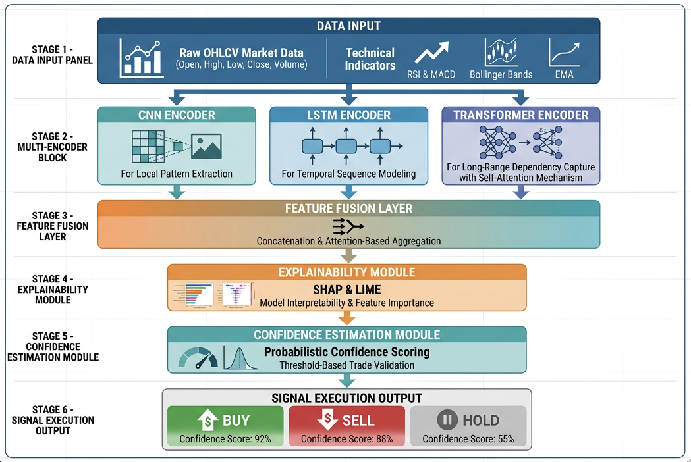

# HybridSwingNet

**Multi-horizon, multi-encoder swing-trading forecaster for Indian equities (NSE).**
Reference implementation and reproduction artifact for the HybridSwingNet paper.

Five specialised encoders (short / mid / long windows + point-in-time context + news
sentiment) fuse through cross-attention into calibrated per-horizon direction and
magnitude heads for horizons **H1, H3, H5, H7, H10**, evaluated with a capital-aware,
cost-realistic backtest on the NIFTY 100 universe.

> **Naming.** The paper calls the system **HybridSwingNet**. The Python package is
> imported as `stockxpert` (the original implementation name) — treat `stockxpert` in the
> code and `HybridSwingNet` in the paper as the same system. This is the **V3** model only;
> earlier V1/V2 variants are not part of this artifact.

---

## Architecture

<p align="center"></p>

| Encoder | Window | Role |
|---|---|---|
| ResNLS | 7 days | Micro-trends, reversals |
| BiGRU | 21 days | Swing momentum |
| BiLSTM | 60 days | Regime structure |
| Context MLP | Point-in-time | Volatility, macro, breadth |
| Sentiment | Rolling 21d | News psychology |

Each horizon blends encoder outputs by relevance — short-heavy for H1, long-only for H10.
V3 replaces learned per-stock IDs with **static stock traits** (sector, beta, liquidity)
and uses **cross-sectional splits** with a **10-day embargo** for honest generalisation.

---

## Results

All headline numbers trace to a single source of truth:
**[`docs/CANONICAL_RESULTS_V2.md`](docs/CANONICAL_RESULTS_V2.md)**. Do not cite figures that
are not in that document.

**Held-out stock direction accuracy** (run `20260522_181848_v3_nifty100_from_nifty500`):

| Horizon | Test (10 stocks) | Blind (10 unseen) |
|--:|--:|--:|
| **H1** | **68.7%** | **70.2%** |
| H3 | 57.6% | 58.9% |
| H5 | 56.0% | 59.4% |

**Reproducibility / honesty note.** The in-sample-period backtest is profitable
(see canonical doc §6). A **pre-registered walk-forward strategy-selection protocol
(2018–2026)** applied out-of-sample produced a **negative** result
(**−64.3% return, Sharpe −0.79**). This is reported in full in the canonical doc and the
paper's limitations — it is not a bug, it is the honest OOS finding.

---

## Repository layout

```
src/stockxpert/          # library (HybridSwingNet implementation)
  v3/                    # V3 model, dataset, training, reporting, live
  models/ dataset/ ...   # shared encoders, features, data, metrics used by V3
scripts/                 # training, backtesting, walk-forward, figure generation
configs/                 # V3 experiment configs (self-contained YAML)
tests/                   # V3 unit tests + shared leakage/shape invariants
backend/                 # inference bundle metadata (weights shipped via Release)
docs/                    # canonical results, feature reference, comprehensive report
```

---

## Reproduce

### 1. Environment

```bash
git clone https://github.com/Onkarj012/HybridSwingNet.git
cd HybridSwingNet
uv sync            # or: pip install -r requirements.txt
```

Python is pinned in `.python-version`; exact deps are locked in `uv.lock`.

### 2. Data

Price/sentiment data is **not committed** (see *Data Availability* below). Fetch it into
`data/` with the loader scripts:

```bash
python scripts/sync_yfinance_data.py          # OHLCV for the NIFTY universe
python scripts/historical_data_loader.py       # historical bars used in the paper
```

### 3. Train

```bash
python scripts/train_v3.py \
  --config configs/v3_nifty100_from_nifty500.yaml \
  --data-dir data/nifty500
# writes a run dir under runs/ (gitignored)
```

### 4. Backtest

```bash
python scripts/backtest_v3.py \
  --run-dir runs/<your_run_dir> \
  --start 2025-01-01 --end 2025-12-31
```

### 5. Walk-forward OOS protocol (the pre-registered evaluation)

```bash
python scripts/walkforward_v3.py       # walk-forward strategy selection 2018–2026
python scripts/compute_stats.py        # canonical statistics
```

### Tests

```bash
pytest tests/            # includes no-leakage and split-integrity checks
```

---

## Data & model availability

To keep the git history small and the artifact reproducible, **data and trained weights
are distributed via GitHub Releases, not committed to git**:

- **Trained checkpoint** — the canonical run
  `20260522_181848_v3_nifty100_from_nifty500` (`checkpoints/model_final.pt`, ~1.78 M
  params) is attached to the release.
- **Frozen dataset snapshot** — the exact price/sentiment CSVs used for the paper numbers.

Public sources (Yahoo Finance, GDELT news) can also be re-fetched with the loader scripts
above; committed configs pin the universe and date ranges so re-fetched data matches.

---

## Citation

If you use this code, please cite the HybridSwingNet paper (see the paper's *Data
Availability* section, which links back to this repository).

## License

[MIT](LICENSE)
