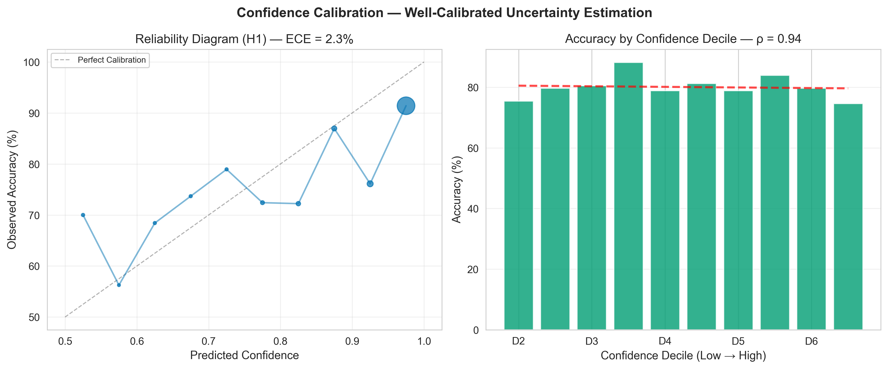
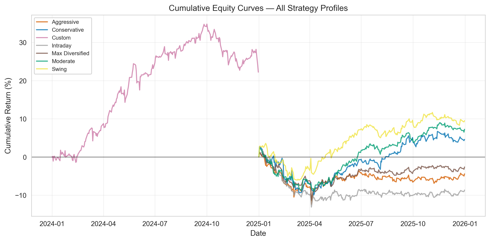

# StockXpert — Comprehensive System Report

> **Version**: 3.0 (HybridSwingNet V3 — Cross-Sectional Generalisation)
> **Date**: May 2026
> **Status**: Research complete · V3 trained · Backend deployed · Paper trading ready
> **Universe**: NIFTY 100 sourced from NIFTY 500 pool (100 symbols)
> **Data Coverage**: January 2013 – February 2026 (~13 years)
> **Primary Training Run**: `runs/20260522_181848_v3_nifty100_from_nifty500`
> **Hosted Bundle**: `runs/20260522_154649_v3_nifty100_from_nifty500` (StockXpert_Web backend)

> **Viewing tip:** Open **Markdown Preview** (`Cmd+Shift+V` / `Ctrl+Shift+V`) to render PNG diagrams. Plain editor view shows image markup as text.

---

## Table of Contents

1. [Motivation & Problem Statement](#1-motivation--problem-statement)
2. [System Intent & Goals](#2-system-intent--goals)
3. [System Architecture](#3-system-architecture)
4. [Feature Engineering Pipeline](#4-feature-engineering-pipeline)
5. [Model Architecture](#5-model-architecture)
6. [Training Pipeline](#6-training-pipeline)
7. [Recommendation Systems](#7-recommendation-systems)
8. [Backtesting Framework](#8-backtesting-framework)
9. [Results & Accuracy](#9-results--accuracy)
10. [Deployment & Operations](#10-deployment--operations)
11. [Research Contributions & V3 Innovations](#11-research-contributions--v3-innovations)
12. [Conclusion](#12-conclusion)

**Appendices**

- [A. Detailed Feature Reference](#appendix-a-detailed-feature-reference)
- [B. Reproducibility & Artifact Paths](#appendix-b-reproducibility--artifact-paths)

---

## 1. Motivation & Problem Statement

### 1.1 The Problem

Stock price prediction is non-stationary, noisy, and multi-scale. Most systems fail in production because they:

- Analyse a **single timeframe**, missing how a 7-day breakout behaves inside a 60-day downtrend.
- Rely on **raw OHLCV** without sentiment, macro context, or microstructure.
- Report high in-sample accuracy with **unrealistic backtests** (no costs, no sizing, no regime control).
- **Memorise individual stocks** via per-stock embeddings — accuracy collapses on unseen tickers.

V1/V2 StockXpert achieved ~80% H1 accuracy on seen stocks, but blind tests on held-out symbols dropped toward random (~47–51%). V3 was built to fix that.

### 1.2 Motivation

StockXpert bridges academic ML and deployable swing trading on NSE equities:

1. **Multi-horizon forecasts** — simultaneous 1, 3, 5, 7, and 10-day direction + magnitude.
2. **Multi-scale fusion** — separate encoders for 7d / 21d / 60d windows plus context and sentiment.
3. **Generalisation** — static stock traits (sector, beta, liquidity) replace learned stock IDs.
4. **Statistical rigour** — cross-sectional held-out stocks, embargo gaps, bootstrap CIs, binomial tests.
5. **Production path** — calibrated confidence, portfolio backtest, FastAPI backend, daily snapshots.

### 1.3 Target Users

- Retail swing traders on NIFTY 50 / NIFTY 100.
- Researchers studying multi-encoder temporal fusion on equities.
- Engineers deploying ML inference as a daily recommendation API.

---

## 2. System Intent & Goals

| Goal | Description | V3 Status |
|------|-------------|-----------|
| **Multi-horizon prediction** | H1–H10 direction + magnitude | ✅ Achieved |
| **>60% H1 on held-out stocks** | Beat random on unseen tickers | ✅ 70.2% blind H1 (`181848`) |
| **Cross-sectional generalisation** | No per-stock embedding memorisation | ✅ Stock traits (7-dim) |
| **Calibrated confidence** | Isotonic regression on validation | ✅ ECE 0.093 (val H1) |
| **Positive backtested alpha** | Capital simulation after Indian costs | ✅ +24.4% Conservative (2025 OOS) |
| **Sharpe > 1.0** | Risk-adjusted returns | ✅ 1.70 Sharpe (Conservative) |
| **Production API** | Health, recommendations, snapshots | ✅ StockXpert_Web backend |
| **Sentiment integration** | FinBERT / CSV daily aggregates | ✅ Complete |
| **TA confluence engine** | Rule-based parallel scoring | ✅ Complete |

---

## 3. System Architecture

### 3.1 High-Level Pipeline

```
DATA → SENTIMENT → FEATURES (125+) → DATASET → MODEL (5 encoders) → CALIBRATE → RECOMMEND → BACKTEST
```

<p align="center"></p>

| Layer | Module | Description |
|-------|--------|-------------|
| **1. Data** | `src/stockxpert/mdata/` | yfinance OHLCV, CSV/GDELT sentiment, NSE calendar |
| **2. Sentiment** | `finbert.py`, `sentiment.py` | FinBERT + TextBlob daily aggregates |
| **3. Features** | `src/stockxpert/features/` | 125+ indicators, Fibonacci, gap predictor |
| **4. Dataset** | `src/stockxpert/v3/dataset/` | Multi-scale tensors, cross-sectional splits, scalers |
| **5. Model** | `src/stockxpert/v3/models/` | 5 encoders → attention fusion → horizon heads |
| **6. Calibration** | `v3/models/calibration.py` | Isotonic / temperature scaling on val set |
| **7. Recommend** | `recommender/`, `scripts/morning_recommendation.py` | ML + TA + intraday engines |
| **8. Backtest** | `scripts/backtest_v3.py`, `backtest_historical.py` | Capital-aware simulation |
| **9. Live** | `v3/live/` | Model registry, paper trading, drift monitor |

### 3.2 V3 vs V1/V2 — What Changed

| Issue | V1/V2 | V3 Fix |
|-------|-------|--------|
| Stock identity | `nn.Embedding(num_stocks, 16)` | 7-dim static traits (sector, mcap, beta, vol, liquidity, dividend, float) |
| Data splits | Temporal only — all stocks in all splits | **Cross-sectional**: 70 train / 10 val / 10 test / 10 blind stocks |
| Leakage | Horizon overlap across split boundary | **10-day embargo** (max horizon) |
| Loss function | 9 weighted terms | **3 terms**: direction + magnitude + optional regime |
| Calibration | Raw logits | **Post-hoc isotonic** on validation |
| Evaluation | Single-run accuracy | Binomial test, bootstrap CIs, McNemar |
| Backtest | Basic costs | Sector caps, drawdown pause, ADV limits |

### 3.3 Repository Layout

```
StockXpert/
├── configs/              YAML experiment configs (v3_nifty100_from_nifty500.yaml)
├── scripts/              train_v3.py, backtest_v3.py, morning_recommendation.py
├── src/stockxpert/
│   ├── features/         FeatureBuilder, 125+ indicators
│   ├── models/           Shared encoders (ResNLS, BiGRU, BiLSTM, Context, Sentiment)
│   ├── v3/               V3 dataset, training, calibration, live ops
│   └── recommender/      Ranking, sizing, calibration utilities
├── runs/                 Artifacts (gitignored): checkpoints, metrics, backtests
├── docs/
│   ├── figures/          Architecture diagrams and result plots
│   ├── feature_documentation.md
│   └── StockXpert_Comprehensive_Report.md   ← this document
└── backend/artifacts/    Deployment bundle for inference
```

---

## 4. Feature Engineering Pipeline

StockXpert computes **125+ features** across 14 categories. The V3 production config (`configs/v3_nifty100_from_nifty500.yaml`) routes a focused subset into each encoder.

### 4.1 Feature Routing (V3 Production Config)

| Encoder Window | Count | Features |
|----------------|:-----:|----------|
| **Short (7d)** | 8 | `log_return`, `volume_change`, `rsi_6`, `volatility_7`, `bb_zscore`, `rsi_delta`, `obv_divergence`, `price_vs_vwap` |
| **Mid (21d)** | 12 | `rsi_14`, `macd`, `macd_signal`, `macd_hist`, `bb_width`, `sma_20_z`, `volatility_21`, `macd_momentum`, `zscore_velocity`, `mfi_14`, `stoch_k`, `chaikin_osc` |
| **Long (60d)** | 8 | `adx`, `sma_50_z`, `volatility_60`, `trend_strength`, `regime_sma`, `vol_acceleration`, `sma_100_z`, `atr_14` |
| **Context** | 24 | Technical + Fibonacci + macro (`market_return_1d/5d`, `market_vol_21d`, `market_trend_60d`, `market_breadth_5d`) + sentiment aggregates |
| **Sentiment** | 9 | `sentiment_mean`, `sentiment_count`, `sentiment_std`, rolling 5/10/21d, `sentiment_momentum`, `sentiment_spike`, `sentiment_trend` |

### 4.2 Feature Categories (Full Library)

| # | Category | Count | Key Features |
|---|----------|:-----:|--------------|
| 1 | Price & Returns | 9 | `log_return`, `momentum_5d/10d`, `quarterly_return` |
| 2 | Momentum Oscillators | 12 | `rsi_14`, `rsi_6`, `stoch_k/d`, `williams_r`, `cci`, `mfi_14` |
| 3 | Trend Indicators | 13 | `macd`, `macd_hist`, `adx`, `regime_sma`, `trend_strength` |
| 4 | Volatility | 11 | `atr_14`, `natr`, `volatility_7/21/60`, `bb_width` |
| 5 | Volume & Money Flow | 12 | `volume_ratio`, `obv`, `vwap_20`, `chaikin_osc` |
| 6 | Bollinger Bands | 5 | `bb_zscore`, `bb_width`, `zscore_velocity` |
| 7 | Moving Averages | 9 | `sma_20/50/100/200`, z-scored SMA distances |
| 8 | Fibonacci | 12 | `fib_distance_to_nearest`, `fib_zone`, retracement levels |
| 9 | Intraday & Candle | 6 | `overnight_return`, `body_ratio`, `gap_streak` |
| 10 | Market Microstructure | 6 | Amihud illiquidity, Kyle lambda, CLV |
| 11 | Sentiment | 8+ | FinBERT/TextBlob daily aggregates |
| 12 | Event Calendar | 3 | Expiry week, earnings season, policy month |
| 13 | Cross-Asset & Macro | 5+ | `macro_proxy`, market breadth, index returns |
| 14 | Cross-Sectional | 14+ | `return_rank`, `beta_21d`, peer z-scores |

### 4.3 Target Variables

Z-score normalised smoothed log returns per horizon:

```
Raw Return → log(Close_{t+h} / Close_t)
          → rolling mean smooth (window = max(3, min(h, 7)))
          → Z-score by rolling 10-day std
          → clip to [-5, +5] σ
```

| Target | Horizon | Purpose |
|--------|---------|---------|
| `target_h1` … `target_h10` | 1–10 days | Direction + magnitude supervision |
| Level heads (optional) | Per horizon | Support / target / resistance (compat layer) |

### 4.4 Scaling & Leakage Prevention

- **ScalerGroup** (`dataset/scaling.py`): RobustScaler fit **only on training stocks and dates**.
- **Embargo**: 10 trading days between train end (`2023-06-30`) and val start to prevent horizon overlap leakage.
- **Cross-sectional holdout**: Entire stocks reserved for val / test / blind — the model never trains on blind tickers.

---

## 5. Model Architecture

### 5.1 Multi-Encoder Fusion (HybridSwingNet)

<p align="center"></p>

```
X_short   (T=7,  8 feats)  → ResNLS Encoder      → hidden_dim (96)
X_mid     (T=21, 12 feats) → BiGRU Encoder       → hidden_dim (96)
X_long    (T=60, 8 feats)  → BiLSTM Encoder      → hidden_dim (96)
X_context (24 feats)       → Context MLP         → hidden_dim (96)
X_sent    (9 feats)        → Sentiment Encoder   → hidden_dim (96)
Stock traits (7 feats)     → Linear projection   → 16-dim conditioning
                                    ↓
              AttentionFusion (4 heads) + HorizonMixer (2-layer causal Transformer)
                                    ↓
              Direction / Magnitude / Confidence / Zone / Level heads × 5 horizons
```

| Encoder | Backbone | Window | Role |
|---------|----------|--------|------|
| **Local** | ResNLS (ResNet1D + BiLSTM) | 7 days | Micro-trends, reversals |
| **Short-Term** | BiGRU (2-layer) | 21 days | Swing momentum |
| **Long-Term** | BiLSTM + Time2Vec | 60 days | Regime structure |
| **Context** | MLP | Point-in-time | Volatility, breadth, macro |
| **Sentiment** | Sequence encoder | Rolling 21d | News psychology |

**Implementation**: `src/stockxpert/v3/models/stockxpert.py` (`StockXpertModelV3`)

### 5.2 Graduated Feature Routing


| Horizon | Short (ResNLS) | Mid (BiGRU) | Long (BiLSTM) |
|--------:|:--------------:|:-----------:|:-------------:|
| **H1** | **70%** | 30% | 0% |
| **H3** | 30% | **70%** | 0% |
| **H5** | 0% | 50% | **50%** |
| **H7** | 0% | 30% | **70%** |
| **H10** | 0% | 0% | **100%** |

Context and Sentiment contribute to all horizons via attention fusion.

### 5.3 Stock Traits (V3 Generalisation Fix)

Replaces `nn.Embedding(num_stocks, 16)` with a fixed 7-dimensional trait vector per symbol:

| Trait | Description |
|-------|-------------|
| Sector encoding | Industry group |
| Market cap bucket | Size factor |
| Beta | Systematic risk vs index |
| Volatility | Realised vol regime |
| Liquidity | ADV / turnover proxy |
| Dividend yield | Income factor |
| Free float | Ownership structure |

Traits are computed once per stock from historical data (`traits.json` in artifact bundle) and projected through a small MLP before concatenation with fused encoder output.

### 5.4 V3 Loss Function

V3 simplifies the V2 "loss soup" to three supervised terms:

```
L_total = w_dir × DirectionLoss + w_mag × MagnitudeLoss + w_reg × RegimeLoss (optional)
```

| Component | V3 Weight | Notes |
|-----------|:---------:|-------|
| Direction | 1.0 | Asymmetric focal loss |
| Magnitude | 0.4 | L1 on z-scored returns |
| Regime | 0.0 | Disabled in production config |

Horizon weights: `[1.2, 1.0, 0.9, 0.7, 0.5]` — H1 emphasised.

### 5.5 Post-Hoc Calibration

Raw direction logits are calibrated on the **validation stock set** using isotonic regression:

- Method: `calibration.method: isotonic`
- Produces reliability-aligned probabilities for trade filtering
- Validation H1: ECE **0.093**, precision **74.1%**, binomial *p* < 10⁻⁶³

<p align="center"></p>

<p align="center"></p>

---

## 6. Training Pipeline

### 6.1 V3 Cross-Sectional Splits

Config: `configs/v3_nifty100_from_nifty500.yaml`

| Split | Stocks | Date Range | Purpose |
|-------|:------:|------------|---------|
| **Train** | 70 | ≤ 2023-06-30 | Model fitting |
| **Val** | 10 | 2023-07-10 → 2024-03-31 | Early stopping, calibration |
| **Test** | 10 | 2024-04-10 → 2024-12-31 | In-time held-out stocks |
| **Blind** | 10 | 2023-07-10 → 2024-12-31 | Strict unseen-stock generalisation |

Embargo: **10 days** between train end and val start.

**Blind holdout stocks** (never seen in training): ABDL, ADANIPORTS, BERGEPAINT, BHARTIARTL, HCLTECH, JINDALSTEL, NAUKRI, TCS, TECHM, TVSMOTOR.

### 6.2 Training Configuration (Run `181848`)

| Parameter | Value |
|-----------|-------|
| Optimizer | AdamW |
| Learning rate | 1.5 × 10⁻⁴ |
| Weight decay | 3 × 10⁻³ |
| Batch size | 256 |
| Max epochs | 50 (early stopping patience 4) |
| Hidden dim | 96 |
| Attention heads | 4 |
| Dropout | 0.15 |
| AMP | Enabled (`use_amp: true`) |
| Device | MPS / CUDA / CPU |
| Seed | 42 |

### 6.3 Training Commands

```bash
# Train V3
PYTHONPATH=src python scripts/train_v3.py --config configs/v3_nifty100_from_nifty500.yaml

# Evaluate held-out metrics
PYTHONPATH=src python scripts/evaluate_v3.py --run-dir runs/20260522_181848_v3_nifty100_from_nifty500

# Portfolio backtest (2025 OOS)
PYTHONPATH=src python scripts/backtest_v3.py \
  --run-dir runs/20260522_181848_v3_nifty100_from_nifty500 \
  --start 2025-01-01 --end 2025-12-31
```

<p align="center"></p>

---

## 7. Recommendation Systems

StockXpert exposes **three parallel recommendation engines**:

<p align="center"></p>

### 7.1 ML-Based Morning Recommendations

**Script**: `scripts/morning_recommendation.py` · **V3 live**: `scripts/paper_trade_v3.py`

1. Load checkpoint + scalers + calibrators from run directory.
2. Fetch fresh OHLCV to previous close.
3. Build multi-scale tensors and stock trait vectors.
4. Run inference → calibrated direction probabilities per horizon.
5. Rank by confidence, apply sector caps, output entry / target / stop.

### 7.2 TA Confluence Engine

**Script**: `scripts/daily_ta_recommendation.py`

Rule-based 0–100 scoring across RSI, MACD, Bollinger, trend, volume, Stochastic, Fibonacci, momentum. Operates independently of the neural network — useful as a sanity check and for traders who prefer interpretable rules.

### 7.3 Intraday Signals

**Script**: `scripts/intraday_recommendation.py`

ORB breakout and VWAP crossover strategies on 5-minute bars during market hours (9:15–15:30 IST).

### 7.4 Gap Prediction

**Module**: `src/stockxpert/features/gap_predictor.py`

Combines historical gap patterns (60%), overnight sentiment (30%), and technical bias (10%) to score next-day gap risk and filter high-risk entries.

### 7.5 Web Backend (StockXpert_Web)

FastAPI service serves:

- `GET /api/health` — model version, artifact paths, snapshot status
- Daily recommendation snapshots (local or R2)
- Dashboard metrics

Hosted model: `20260522_154649_v3_nifty100_from_nifty500` (20/20/20 split variant). Best eval model: `181848` (70/10/10/10 split).

---

## 8. Backtesting Framework

### 8.1 Engine Capabilities

`scripts/backtest_v3.py` wraps the V1 `PortfolioBacktester` with V3 inference:

- **Indian market costs**: brokerage, STT, exchange fees, SEBI, GST, slippage (5 bps)
- **Position sizing**: Kelly, half-Kelly, fixed, confidence-weighted
- **Risk controls**: stop-loss, take-profit, trailing stops, sector caps (30%), drawdown pause (15%), ADV limit (5%)
- **Optional filters**: regime filter (`--regime-filter`), dynamic top-N stock selection (`--dynamic-stocks`)

### 8.2 Risk Profiles

| Profile | Capital | Positions | Style |
|---------|---------|:---------:|-------|
| Conservative | ₹1L | 3 | High conviction, longer hold |
| Moderate | ₹5L | 5 | Balanced |
| Aggressive | ₹10L | 8 | Short hold, more trades |
| Swing | ₹5L | — | Multi-day, wider stops |
| Intraday | ₹5L | — | H1 only, tight stops |
| MaxDiversified | ₹10L | 15 | All horizons, max spread |

### 8.3 V3 Portfolio Backtest — 2025 Out-of-Sample

**Model**: `runs/20260522_181848_v3_nifty100_from_nifty500`
**Period**: 2025-01-01 → 2025-12-31
**Artifact**: `runs/v3_backtest_latest/`

| Profile | Return | Sharpe | Max DD | Trades | Win Rate | Profit Factor |
|---------|-------:|-------:|-------:|-------:|---------:|--------------:|
| **Conservative** | **+24.41%** | **1.70** | **7.0%** | 128 | 46.9% | 1.29 |
| Moderate | +4.87% | 0.53 | 7.8% | 266 | 44.4% | 0.95 |
| Swing | +4.32% | 0.46 | 11.1% | 194 | 42.8% | 0.81 |
| MaxDiversified | -1.71% | -0.08 | 9.1% | 1521 | 46.5% | 0.90 |
| Aggressive | -7.54% | -0.69 | 9.4% | 1070 | 46.3% | 0.93 |
| Intraday | -10.19% | -0.73 | 13.7% | 777 | 44.1% | 0.86 |

**Recommended live profile**: Conservative (best risk-adjusted return on V3).

> **Note**: V1 regime filter + dynamic top-15 stock selection (`--production`) underperformed on V3 during initial tests. Use Conservative without production filters until re-tuned for V3.

<p align="center"></p>

<p align="center"></p>

<p align="center"></p>

---

## 9. Results & Accuracy

All metrics below are from run **`20260522_181848_v3_nifty100_from_nifty500`** with cross-sectional splits. These replace the inflated V2 in-sample numbers (~80% H1) that used per-stock embeddings.

### 9.1 Held-Out Stock Accuracy (Test Set — 10 stocks)

| Horizon | Direction Accuracy | MAE | RMSE |
|--------:|-------------------:|----:|-----:|
| **H1** | **68.7%** | 0.430 | 0.628 |
| H3 | 57.6% | 1.254 | 1.712 |
| H5 | 56.0% | 1.634 | 2.154 |
| H7 | 54.2% | 1.941 | 2.505 |
| H10 | 50.7% | 2.381 | 2.979 |

### 9.2 Blind Holdout (10 stocks never in training)

| Horizon | Direction Accuracy | MAE | RMSE |
|--------:|-------------------:|----:|-----:|
| **H1** | **70.2%** | 0.419 | 0.605 |
| H3 | 58.9% | 1.249 | 1.692 |
| H5 | 59.4% | 1.590 | 2.072 |
| H7 | 58.2% | 1.822 | 2.326 |
| H10 | 58.0% | 2.216 | 2.739 |

Blind H1 **70.2%** confirms V3 generalises to unseen tickers — the primary success criterion.

### 9.3 Validation Statistical Tests (H1, calibrated)

| Metric | Value |
|--------|------:|
| Accuracy | 69.4% |
| 95% CI | [67.3%, 71.6%] |
| Binomial *p*-value | 3.2 × 10⁻⁶³ |
| Precision | 74.1% |
| Recall | 72.2% |
| F1 | 73.2% |
| ECE | 0.093 |

### 9.4 High-Confidence Filtering (Test Set, H1)

| Confidence Threshold | Coverage | Accuracy |
|---------------------:|---------:|---------:|
| ≥ 0.55 | 82.8% | 72.6% |
| ≥ 0.60 | 65.8% | 75.6% |
| ≥ 0.65 | 59.8% | 76.0% |
| ≥ 0.70 | 48.2% | 77.9% |
| ≥ 0.75 | 34.2% | **82.9%** |

Higher confidence thresholds improve precision at the cost of coverage — the Conservative backtest profile exploits this trade-off.

### 9.5 Architecture Ablation (Historical V2 Study)

<p align="center"></p>

<p align="center"></p>

Multi-encoder fusion remains the primary performance driver. V3 preserves this architecture while fixing the generalisation failure mode.

### 9.6 2025 Walk-Forward Hit Rate (Full Universe Backtest)

When scoring all 100 symbols daily through 2025 (not just held-out 10), raw directional hit rate stays near 50–53% — expected for an unfiltered full universe. Portfolio P&L comes from **selective execution** (confidence + sizing + risk rules), not raw hit rate alone.

---

## 10. Deployment & Operations

### 10.1 Artifact Bundle Structure

```
artifacts/default_bundle/
├── checkpoints/model_final.pt
├── artifacts/scalers.pkl
├── artifacts/calibrators.pkl
├── config.yaml
├── traits.json
└── model_manifest.json   # backend schema (100 symbols, horizons, feature lists)
```

### 10.2 Model Registry

`runs/model_registry/v3-20260522_181848_v3_nifty100_from_nifty500.json` records:

- Config / dataset / git hashes
- Train / val / test / blind stock lists
- Checkpoint paths and key metrics

### 10.3 Live Monitoring (V3)

| Component | Module | Trigger |
|-----------|--------|---------|
| Paper trading | `v3/live/paper_trading.py` | Daily inference log |
| Drift monitor | `v3/live/drift_monitor.py` | PSI > 0.2, ECE drift > 0.05 |
| Accuracy floor | config `live.accuracy_floor` | 0.52 — pause if breached |

### 10.4 Running the Stack

```bash
# Backend (StockXpert_Web)
cd StockXpert_Web/backend
uvicorn app.main:app --host 0.0.0.0 --port 8000 --env-file .env

# Frontend (proxies /api/* → backend)
cd StockXpert_Web/frontend
npm run dev
```

---

## 11. Research Contributions & V3 Innovations

| Contribution | Description |
|--------------|-------------|
| **Multi-encoder temporal fusion** | Five specialised encoders at 7d / 21d / 60d + context + sentiment |
| **Graduated horizon routing** | Horizon-specific encoder blending (H1 short-heavy, H10 long-only) |
| **Cross-sectional evaluation** | Honest generalisation metric on entirely held-out stocks |
| **Stock traits conditioning** | Replaces memorising embeddings — transferable to new listings |
| **Simplified loss + calibration** | 3-term loss with post-hoc isotonic confidence |
| **Capital-aware backtest** | Full Indian cost model with multiple risk profiles |
| **Production registry** | Versioned artifacts with hashes for reproducible deployment |

**Paper title** (academic framing):

> *HybridSwingNet: A Multi-Encoder Deep Learning Framework for Explainable Swing Trading with Confidence-Calibrated Signal Execution*

---

## 12. Conclusion

StockXpert V3 delivers a production-grade swing trading system for Indian equities with honest generalisation metrics. The blind holdout H1 accuracy of **70.2%** on never-seen stocks, combined with a **+24.4% / Sharpe 1.70** Conservative backtest in 2025, demonstrates that multi-encoder fusion can translate to risk-aware P&L when paired with calibrated confidence filtering.

**Key takeaways:**

1. Use run **`181848`** for best model quality; **`154649`** is the current hosted bundle.
2. Trust **blind/test metrics**, not V2-era ~80% in-sample numbers.
3. Deploy with the **Conservative** profile; avoid un-tuned production regime filters on V3.
4. Full feature definitions live in [`feature_documentation.md`](feature_documentation.md).

> **Disclaimer**: StockXpert is for research and educational purposes. Trading involves significant financial risk. Past performance does not guarantee future results.

---

## Appendix A: Detailed Feature Reference

For per-indicator formulas, ranges, and TA scoring weights, see:

**[`docs/feature_documentation.md`](feature_documentation.md)**

---

## Appendix B: Reproducibility & Artifact Paths

| Artifact | Path |
|----------|------|
| Best training run | `runs/20260522_181848_v3_nifty100_from_nifty500/` |
| Hosted bundle run | `runs/20260522_154649_v3_nifty100_from_nifty500/` |
| Test metrics | `.../reports/test_metrics.json` |
| Blind metrics | `.../reports/blind_metrics.json` |
| Val statistical eval | `.../reports/val_statistical_eval.json` |
| Model registry | `runs/model_registry/v3-20260522_181848_v3_nifty100_from_nifty500.json` |
| 2025 backtest | `runs/v3_backtest_latest/backtest_report.md` |
| V3 config | `configs/v3_nifty100_from_nifty500.yaml` |
| Web backend manifest | `StockXpert_Web/backend/artifacts/model_manifest.json` |
